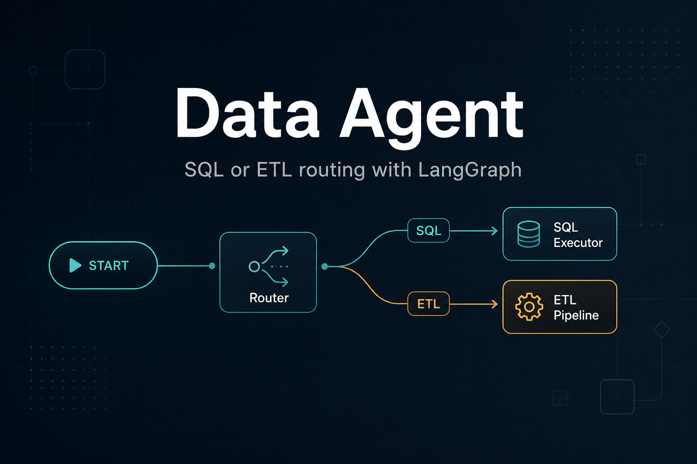

# Data Agent

[](https://www.python.org/)
[](https://docs.astral.sh/uv/)
[](https://www.langchain.com/)
[](https://github.com/langchain-ai/langgraph)
[](https://docs.pydantic.dev/)
[](https://www.postgresql.org/)
[](https://pandas.pydata.org/)
[](https://openai.com/)
[](https://www.anthropic.com/)
[](LICENSE)
[](https://github.com/javakishore-veleti/Data_Agent/commits/main)



A LangGraph data agent that classifies a natural-language request as **SQL** or **ETL**, then runs the matching subgraph.

- **SQL** — curate the question, generate a Postgres query from live schema, judge it for read-only safety, execute it, and answer in plain language.
- **ETL** — extract JSON from an HTTP API (or transform a local file with generated Pandas) and save CSV / JSON / Parquet.

The router and ETL path use Claude. The SQL path uses OpenAI models of increasing size for curation, generation, and the safety judge.

## Table of contents

- [Why LangGraph and LangChain](#why-langgraph-and-langchain)
- [Architecture](#architecture)
- [Evaluation and in-graph safety](#evaluation-and-in-graph-safety)
- [Repository layout](#repository-layout)
- [Requirements](#requirements)
- [Setup](#setup)
- [Run](#run)
- [Models](#models)
- [License](#license)

## Why LangGraph and LangChain

This repo uses **both**. LangChain talks to models and tools. LangGraph is the **workflow** that decides what runs next.

LangChain is good at one step: `llm.invoke(...)`, `bind_tools`, `with_structured_output`. It is a poor fit when the next step **depends on state**:

| This code | Why a graph helps |
| --- | --- |
| Router: `sql` or `etl` | Conditional branch after the classifier |
| SQL: generate → judge → execute **or** cancel | A safety gate, not a straight chain |
| ETL: LLM → tools → LLM until no tool calls | A loop, not a fixed pipeline |
| `DataAgentSchema` / `AgentSchema` | Shared state (`messages`, `route_response`, `is_safe`) |

A LangChain sequential chain always goes A → B → C. You would have to write your own `if` / `while` around those calls. LangGraph is that control flow: nodes, edges, and `add_conditional_edges`.

- **LangChain** — the workers (Claude, OpenAI, tools, structured output)
- **LangGraph** — the supervisor (route, loop, stop)

You would not replace LangGraph with “just LangChain” unless you flattened those branches and loops into handwritten Python. You also would not drop LangChain: `pick_llm`, tools, and messages already come from it.

## Architecture

```text
START
  → router_node
  → route_safety_eval      # sql | etl only; else route_rejected_node → END
       ├─ sql_node  → SQL analyst subgraph
       └─ etl_node  → ETL analyst subgraph
```

**SQL analyst**

```text
curate_ques → prompt_query_context → generate_sql
                 ├─ keyword_sql_eval     # no LLM: writes / stacked statements
                 └─ is_safe_sql          # LLM JudgeSchema
                        ↓
              sql_safety_consensus       # any fail → No
                 ├─ Yes → execute_sql → represent_final_answer → END
                 └─ No  → canceled_sql → END
```

**ETL analyst**

```text
START → llm_node → (tool calls?)
                 ├─ no  → END
                 └─ yes → etl_tool_safety_eval   # URL, format, path under data/
                            ├─ Yes → tool_node → llm_node
                            └─ No  → llm_node (blocked ToolMessage, no exec)
```

`transform_load_tool` also runs a Pandas snippet check before `exec`.

ETL tools:

| Tool | Role |
| --- | --- |
| `extract_load_tool` | `GET` an API, flatten `results` with Pandas, write `extracted_data.{csv\|json\|parquet}` |
| `transform_load_tool` | Sample the file, generate Pandas, `exec` it, write into the transform folder |

## Evaluation and in-graph safety

This project does **not** add commercial eval or observability products (Galileo, LangSmith, Arize, Langfuse Cloud, Braintrust, W&B, Confident AI, and similar). Safety lives in the graphs and in local tests.

**In the graph (fail closed):** extra nodes after a risky step, then a consensus that **stops** if any check fails — no averaging LLM scores.

| Pipeline | Checks |
| --- | --- |
| Router | `route_safety_eval`: `answer` is only `sql` or `etl` |
| SQL | `keyword_sql_eval` + `is_safe_sql` → `sql_safety_consensus`; any fail → `canceled_sql` |
| ETL | `etl_tool_safety_eval` before tools; Pandas pattern check before `exec` |

**Offline:** **pytest** plus gold JSON (router `sql` vs `etl`, judge Yes/No on fixed queries, ETL file fixtures). No LLM-as-a-service leaderboard.

The SQL subgraph keeps the LLM gate (`is_safe_sql`). The keyword check runs beside it and **vetoes** execution. Helpers live in `utils/safety.py`.

## Repository layout

```text
main.py                 # invoke the compiled data agent
agents/
  data_agent.py         # router + SQL/ETL dispatch
  sql_analyst.py        # SQL subgraph
  etl_analyst.py        # ETL subgraph (tool-calling loop)
Models/schema.py        # Pydantic graph state and structured outputs
utils/
  llm_pickup.py         # pick_llm("low"|"medium"|"high"|"claude")
  database.py           # Postgres connect, schema dump, execute
  etl_tools.py          # extract / preview / execute generated Pandas
  safety.py             # fail-closed SQL/ETL/path checks (no commercial evals)
data/
  users.csv, rides.csv, vehicles.csv, payments.csv, ratings.csv
  extract/              # ETL extract output
  transform/            # ETL transform output
.env.template           # Postgres settings to copy into .env
```

Sample CSVs are a rideshare-style dataset (users, rides, vehicles, payments, ratings) intended for the SQL path once loaded into Postgres.

## Requirements

- Python 3.12+
- [uv](https://docs.astral.sh/uv/)
- API keys for the models you use (`ANTHROPIC_API_KEY`, `OPENAI_API_KEY`)
- Postgres, if you run the SQL path

## Setup

```bash
uv sync
cp .env.template .env
```

Fill `.env`. `utils/database.py` reads:

```text
POSTGRES_HOST=localhost
POSTGRES_PORT=5432
POSTGRES_USER=postgres
POSTGRES_PASSWORD=
POSTGRES_DB=postgres
```

`sql_analyst.py` currently reads `host`, `port`, `user`, `password`, and `database` from the environment when it builds a connection. Set those as well (same values as the `POSTGRES_*` keys) until both paths share one config.

Also set:

```text
ANTHROPIC_API_KEY=
OPENAI_API_KEY=
```

Load the sample CSVs into the `public` schema of `POSTGRES_DB` before asking SQL questions.

## Run

From the repo root (so `agents` and `Models` import cleanly):

```bash
uv run python main.py
```

`main.py` asks the agent to extract [PokeAPI](https://pokeapi.co/api/v2/pokemon) into `data/extract` as CSV. That should route to ETL.

Run a subgraph directly:

```bash
uv run python agents/etl_analyst.py
uv run python agents/sql_analyst.py
```

The SQL `__main__` example asks which payment methods exist in the database.

Importing `agents/data_agent.py` also writes `data_agent_graph.png` (Mermaid render of the compiled graph).

## Models

`utils/llm_pickup.py` maps a level to a chat model:

| Level | Model |
| --- | --- |
| `low` | `gpt-5.6-luna` |
| `medium` | `gpt-5.6-terra` |
| `high` | `gpt-5.6-sol` |
| `claude` | `claude-sonnet-5` |

The data-agent router and ETL analyst use `claude`. SQL curation and the final answer use `low`; SQL generation and the safety judge use `medium`.

## License

Apache License 2.0. See [LICENSE](LICENSE).
