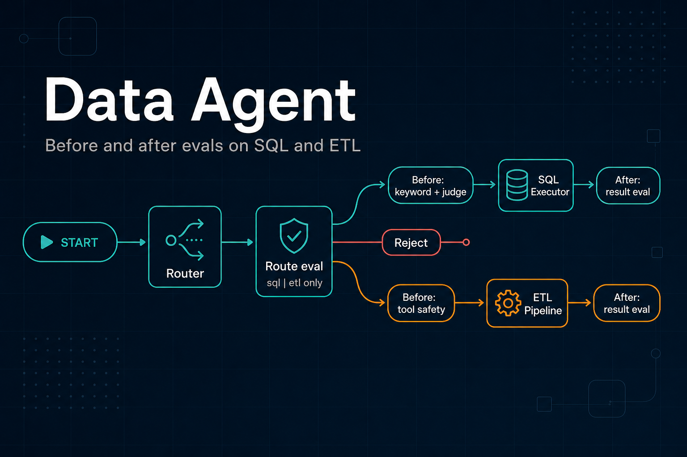
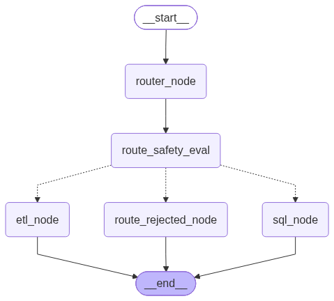

# Data Agent

[](https://www.python.org/)
[](https://docs.astral.sh/uv/)
[](https://www.langchain.com/)
[](https://github.com/langchain-ai/langgraph)
[](https://docs.pydantic.dev/)
[](https://www.postgresql.org/)
[](https://pandas.pydata.org/)
[](https://openai.com/)
[](https://www.anthropic.com/)
[](LICENSE)
[](https://github.com/javakishore-veleti/Data_Agent/commits/main)



A LangGraph data agent that classifies a natural-language request as **SQL** or **ETL**, then runs the matching subgraph.

- **SQL** — curate the question, generate a Postgres query from live schema, judge it for read-only safety, execute it, and answer in plain language.
- **ETL** — extract JSON from an HTTP API (or transform a local file with generated Pandas) and save CSV / JSON / Parquet.

The router and ETL path use Claude. The SQL path uses OpenAI models of increasing size for curation, generation, and the safety judge.

## Table of contents

- [Why LangGraph and LangChain](#why-langgraph-and-langchain)
- [Architecture](#architecture)
- [Evals](#evals)
- [Repository layout](#repository-layout)
- [Requirements](#requirements)
- [Setup](#setup)
- [Run](#run)
- [Models](#models)
- [License](#license)

## Why LangGraph and LangChain

This repo uses **both**. LangChain talks to models and tools. LangGraph is the **workflow** that decides what runs next.

LangChain is good at one step: `llm.invoke(...)`, `bind_tools`, `with_structured_output`. It is a poor fit when the next step **depends on state**:

| This code | Why a graph helps |
| --- | --- |
| Router: `sql` or `etl` | Conditional branch after the classifier |
| SQL: generate → judge → execute **or** cancel | A safety gate, not a straight chain |
| ETL: LLM → tools → LLM until no tool calls | A loop, not a fixed pipeline |
| `DataAgentSchema` / `AgentSchema` | Shared state (`messages`, `route_response`, `is_safe`) |

A LangChain sequential chain always goes A → B → C. You would have to write your own `if` / `while` around those calls. LangGraph is that control flow: nodes, edges, and `add_conditional_edges`.

- **LangChain** — the workers (Claude, OpenAI, tools, structured output)
- **LangGraph** — the supervisor (route, loop, stop)

You would not replace LangGraph with “just LangChain” unless you flattened those branches and loops into handwritten Python. You also would not drop LangChain: `pick_llm`, tools, and messages already come from it.

## Architecture

Compiled parent graph (router, route eval, SQL / ETL / reject). Before/after SQL and ETL evals live in the subgraphs; see the banner above.



```text
START
  → router_node
  → route_safety_eval      # sql | etl only; else route_rejected_node → END
       ├─ sql_node  → SQL analyst subgraph
       └─ etl_node  → ETL analyst subgraph
```

**SQL analyst**

```text
curate_ques → prompt_query_context → generate_sql
                 ├─ keyword_sql_eval     # before execute
                 └─ is_safe_sql
                        ↓
              sql_safety_consensus
                 ├─ Yes → execute_sql → sql_after_eval
                 │                         ├─ Yes → represent_final_answer → END
                 │                         └─ No  → sql_result_failed → END
                 └─ No  → canceled_sql → END
```

**ETL analyst**

```text
START → llm_node → (tool calls?)
                 ├─ no  → END
                 └─ yes → etl_tool_safety_eval   # before tools
                            ├─ Yes → tool_node → etl_result_eval
                            │                       ├─ Yes → llm_node
                            │                       └─ No  → etl_result_failed → END
                            └─ No  → llm_node (blocked ToolMessage, no exec)
```

`transform_load_tool` also runs a Pandas snippet check before `exec`.

ETL tools:

| Tool | Role |
| --- | --- |
| `extract_load_tool` | `GET` an API, flatten `results` with Pandas, write `extracted_data.{csv\|json\|parquet}` |
| `transform_load_tool` | Sample the file, generate Pandas, `exec` it, write into the transform folder |

## Evals

This project does **not** add commercial eval or observability products (Galileo, LangSmith, Arize, Langfuse Cloud, Braintrust, W&B, Confident AI, and similar). An **eval** here is a fail-closed graph node (or a helper it calls) that returns **pass or fail** and can **stop** the next risky step. No score averaging.

**Tool safety is an eval.** `etl_tool_safety_eval` is the ETL **before-tool** gate. `etl_result_eval` is the **after-tool** gate (file exists and is non-empty).

| Core section | Before | After |
| --- | --- | --- |
| SQL execution | `keyword_sql_eval` + `is_safe_sql` → `sql_safety_consensus` | `sql_after_eval` on the driver result; fail → `sql_result_failed` |
| ETL pipeline | `etl_tool_safety_eval` before `tool_node`; `pandas_code_is_safe` before `exec` | `etl_result_eval` on the written file; fail → `etl_result_failed` |

| Eval | Why | What it does | Library | Input | Output |
| --- | --- | --- | --- | --- | --- |
| `route_safety_eval` | Router must only send `sql` or `etl` | Allow those two labels; otherwise `route_rejected_node` | None (Python `in`) | `route_response` | `route_safe` Yes/No + comments |
| `keyword_sql_eval` | Block writes and stacked SQL without an LLM | Regex + statement split in `utils/safety.py` | stdlib `re` | `generated_sql_query` | `keyword_safe` Yes/No + reason |
| `is_safe_sql` | Second opinion: read-only intent | LLM returns `JudgeSchema` | LangChain `with_structured_output`, OpenAI (`pick_llm("medium")`) | `generated_sql_query` | `is_safe` Yes/No + comments |
| `sql_safety_consensus` | Any pre-exec fail must veto execute | AND the two SQL evals; fail closed | None | `keyword_safe`, `is_safe`, comments | `is_safe` Yes → `execute_sql`; No → `canceled_sql` |
| `sql_after_eval` | Do not summarize a missing/error result | `sql_result_eval`: reject `None`, empty, or error strings | stdlib | `sql_execution_result` | `sql_result_safe` Yes → `represent_final_answer`; No → `sql_result_failed` |
| `etl_tool_safety_eval` (**tool safety**) | Do not GET or write until args are allowed | `validate_etl_tool`: http(s) URL, path under `data/extract` or `data/transform`, format csv/json/parquet | stdlib `pathlib`, `urllib.parse` | last AI `tool_calls` | `etl_safe` Yes → `tool_node`; No → blocked `ToolMessage`, no exec |
| `pandas_code_is_safe` | Generated Pandas is `exec`'d | Ban `os.system`, `subprocess`, nested `eval`/`exec`, etc. | stdlib string match | Pandas snippet inside `transform_load_tool` | allow `exec` or return `Transform blocked: …` |
| `etl_result_eval` | Confirm the pipeline actually wrote data | `eval_etl_tool_result`: extract file exists and size > 0; transform folder has a fresh non-empty file | stdlib `pathlib` | tool args + `ToolMessage` | `etl_result_safe` Yes → `llm_node`; No → `etl_result_failed` |

Helpers live in `utils/safety.py`. The SQL LLM gate (`is_safe_sql`) stays; the keyword check runs **beside** it and can still veto.

**Offline (not in-graph, not implemented yet):** pytest plus gold JSON (router `sql` vs `etl`, judge Yes/No on fixed queries, ETL path fixtures). No LLM-as-a-service leaderboard.

## Repository layout

```text
main.py                 # invoke the compiled data agent
agents/
  data_agent.py         # router + SQL/ETL dispatch
  sql_analyst.py        # SQL subgraph
  etl_analyst.py        # ETL subgraph (tool-calling loop)
Models/schema.py        # Pydantic graph state and structured outputs
utils/
  llm_pickup.py         # pick_llm("low"|"medium"|"high"|"claude")
  database.py           # Postgres connect, schema dump, execute
  etl_tools.py          # extract / preview / execute generated Pandas
  safety.py             # fail-closed SQL/ETL/path checks (no commercial evals)
data/
  users.csv, rides.csv, vehicles.csv, payments.csv, ratings.csv
  extract/              # ETL extract output (gitignored; folder kept via .gitkeep)
  transform/            # ETL transform output (gitignored; folder kept via .gitkeep)
.env.template           # Postgres settings to copy into .env
package.json            # npm scripts that wrap uv run
```

Sample CSVs are a rideshare-style dataset (users, rides, vehicles, payments, ratings) intended for the SQL path once loaded into Postgres.

## Requirements

- Python 3.12+
- [uv](https://docs.astral.sh/uv/)
- API keys for the models you use (`ANTHROPIC_API_KEY`, `OPENAI_API_KEY`)
- Postgres, if you run the SQL path

## Setup

```bash
uv sync
cp .env.template .env
```

Fill `.env`. `utils/database.py` reads:

```text
POSTGRES_HOST=localhost
POSTGRES_PORT=5432
POSTGRES_USER=postgres
POSTGRES_PASSWORD=
POSTGRES_DB=postgres
LOG_LEVEL=INFO
```

`sql_analyst.py` currently reads `host`, `port`, `user`, `password`, and `database` from the environment when it builds a connection. Set those as well (same values as the `POSTGRES_*` keys) until both paths share one config.

Also set:

```text
ANTHROPIC_API_KEY=
OPENAI_API_KEY=
```

Load the sample CSVs into the `public` schema of `POSTGRES_DB` before asking SQL questions.

## Run

From the repo root (so `agents` and `Models` import cleanly). `package.json` wraps the same commands for `npm run`.

```bash
uv sync
npm start
```

Equivalent:

```bash
uv run python main.py
npm run agent
npm run graph
```

`main.py` asks the agent to extract [PokeAPI](https://pokeapi.co/api/v2/pokemon) into `data/extract` as CSV. That should route to ETL.

Default logging is `INFO` (eval outcomes, last assistant reply, plus warnings/errors). Prompts, generated SQL, and the full graph state are `DEBUG`:

```bash
npm run start:debug
LOG_LEVEL=DEBUG uv run python main.py
```

Set `LOG_LEVEL` in `.env` (see `.env.template`) or on the command line.

Run a subgraph directly:

```bash
npm run etl
npm run sql
```

Same as:

```bash
uv run python agents/etl_analyst.py
uv run python agents/sql_analyst.py
```

The SQL `__main__` example asks which payment methods exist in the database.

Importing `agents/data_agent.py` also writes `data_agent_graph.png` (Mermaid render of the compiled graph).

## Models

`utils/llm_pickup.py` maps a level to a chat model:

| Level | Model |
| --- | --- |
| `low` | `gpt-5.6-luna` |
| `medium` | `gpt-5.6-terra` |
| `high` | `gpt-5.6-sol` |
| `claude` | `claude-sonnet-5` |

The data-agent router and ETL analyst use `claude`. SQL curation and the final answer use `low`; SQL generation and the safety judge use `medium`.

## License

Apache License 2.0. See [LICENSE](LICENSE).
